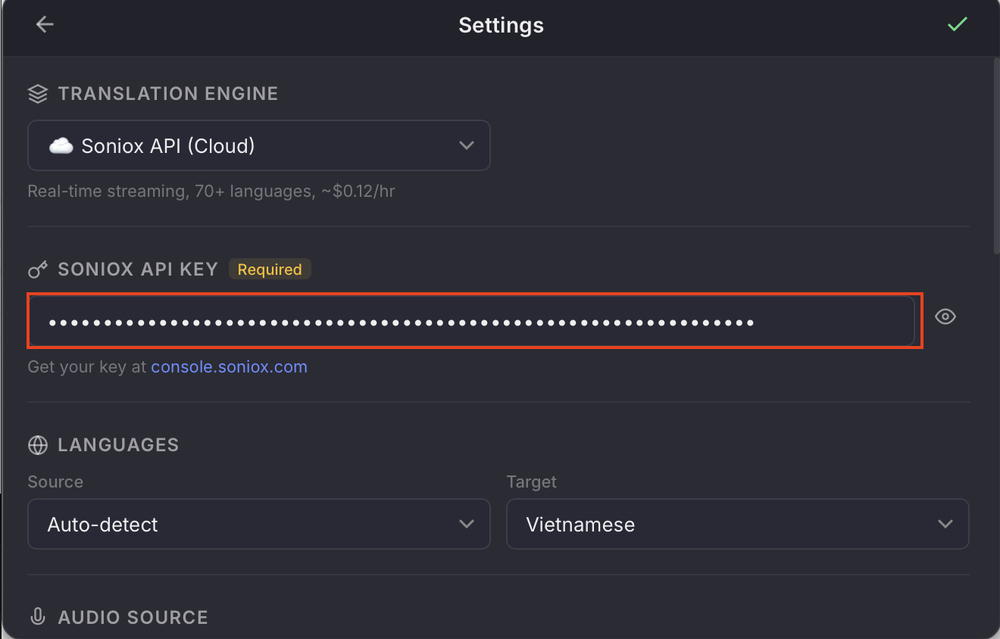
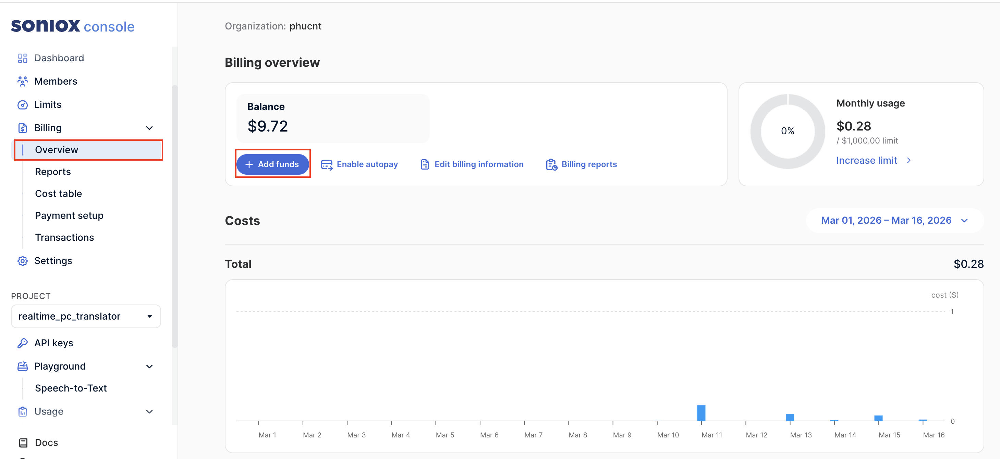
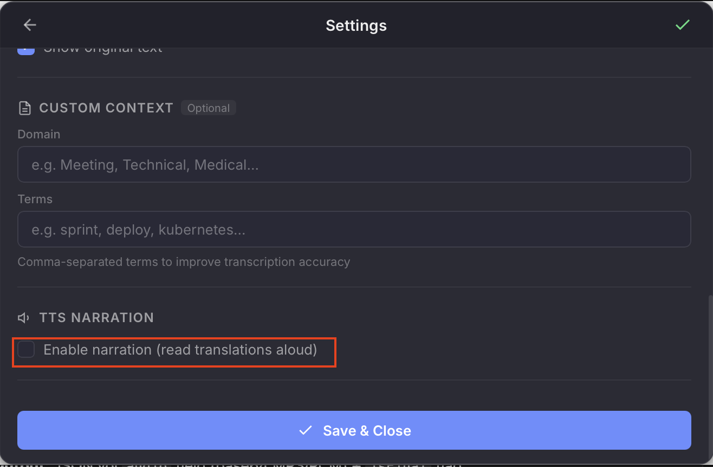
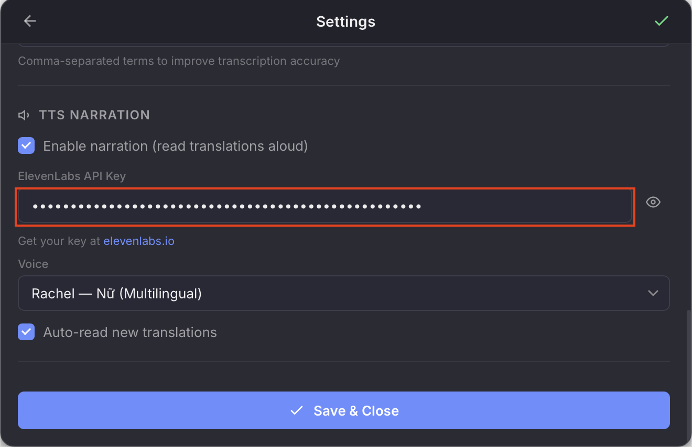
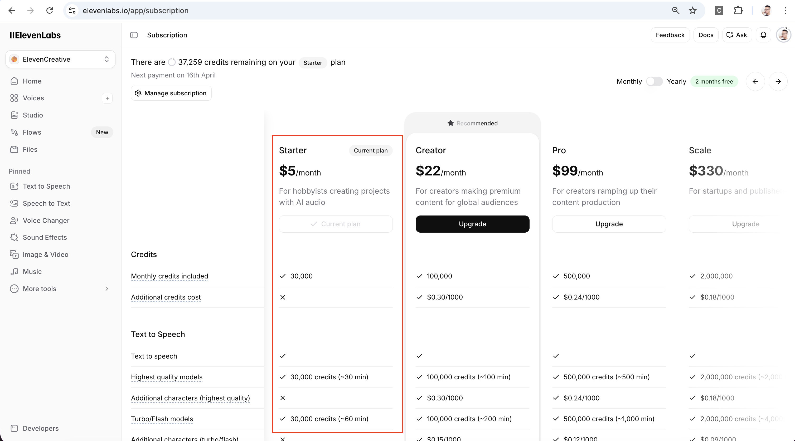
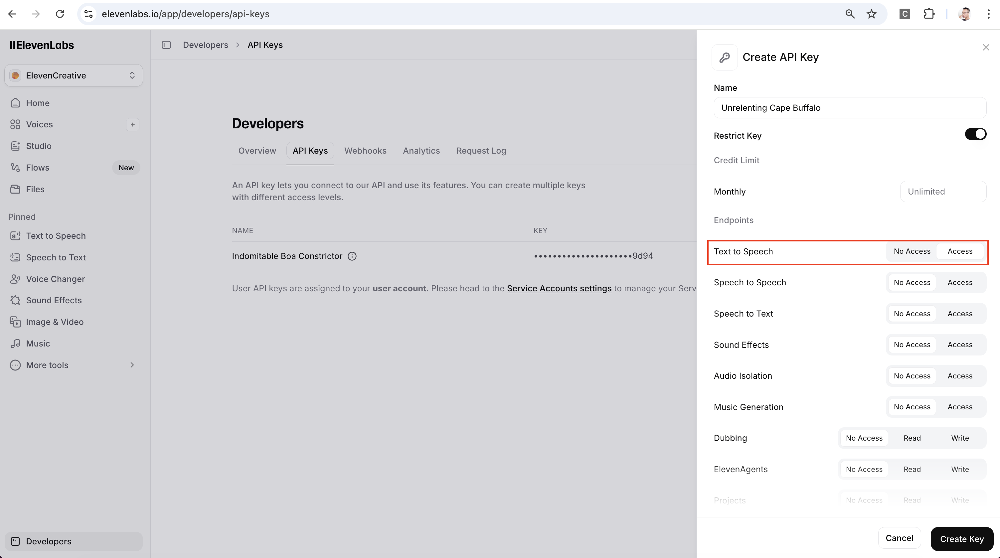

# Installation Guide

Step-by-step guide to install and use **My Translator** on macOS.

---

## Requirements

- macOS 13 or later (Apple Silicon — M1/M2/M3/M4)
- **Cloud mode**: [Soniox](https://soniox.com) API key (pay-per-use, ~$0.12/hour)
- **Local mode**: ~5 GB free disk space (for AI models, one-time download)
- **TTS narration** (optional): [ElevenLabs](https://elevenlabs.io) API key (Starter plan $5/month)

---

## Step 1 — Download

Download the latest `.dmg` from: [**Releases — macOS**](https://github.com/phuc-nt/my-translator/releases/tag/v0.4.2)

---

## Step 2 — Install

Open the `.dmg` file → drag **My Translator** into the **Applications** folder.


---

## Step 3 — Bypass Gatekeeper

> ⚠️ The app is not yet signed with an Apple Developer certificate (pending approval). macOS will block it on first open.

Open **Terminal** and run this command **once**:

```bash
xattr -cr /Applications/My\ Translator.app
```


Then open My Translator from Applications as usual.

---

## Step 4 — Grant Screen Recording Permission

On first launch, macOS will ask for **Screen & System Audio Recording** permission. This is required for the app to capture system audio.

Click **Open System Settings** to go to the permission page.


---

## Step 5 — Enable Permission in System Settings

Find **My Translator** in the list and **toggle the switch** to ON.


macOS will ask you to **Quit & Reopen** the app — click that button to restart with the new permissions.


---

## Step 6 — Choose Translation Mode

After the app reopens, click ⚙️ (or press `⌘ ,`) to open **Settings**.

First, choose your **Translation Engine**:

| Mode | Speed | Quality | Cost | Internet |
|------|-------|---------|------|----------|
| ☁️ **Soniox API (Cloud)** | Real-time (~2s) | 9/10 | ~$0.12/hr | Required |
| 🖥️ **Local MLX (Offline)** | ~10s delay | 7/10 | Free | Not needed |

### Option A: Cloud Mode (Soniox)

1. Select **☁️ Soniox API (Cloud)** as Translation Engine
2. Paste your Soniox API key
3. Choose Source & Target languages
4. Click **Save & Close** (✓ button at top or bottom)



> 💡 **Where to get a Soniox API key?**
> 1. Go to [console.soniox.com](https://console.soniox.com) → create an account
> 2. Add funds ($10 minimum, lasts a long time at ~$0.12/hour)
> 3. Go to **API Keys** → create and copy your key



### Option B: Local Mode (MLX — Apple Silicon only)

1. Select **🖥️ Local MLX (Offline)** as Translation Engine
2. Choose Source & Target languages
3. Click **Save**
4. On first use, the app will **automatically download** AI models (~5 GB, one-time)
5. Model loading takes ~30-60 seconds on first start

> ⚠️ Local mode requires Apple Silicon (M1/M2/M3/M4) and ~6-7 GB RAM.
> It is not available on Intel Macs.

---

## Step 7 — Enable TTS Narration (Optional)

Want translations **read aloud**? Enable TTS narration:

1. In Settings, scroll to **TTS Narration** section
2. Check **"Enable narration (read translations aloud)"**



3. Enter your **ElevenLabs API key**
4. Choose a **voice** (2 female, 2 male — all support Vietnamese)
5. Click **Save & Close**



> 💡 **Where to get an ElevenLabs API key?**
> 1. Go to [elevenlabs.io](https://elevenlabs.io) → create an account
> 2. Subscribe to the **Starter plan** ($5/month, ~60 min of TTS)
> 3. Go to **Developers → API Keys** → create a key with "Text to Speech" access




> 💡 TTS is optional. If disabled, the app works exactly like before — transcript & translate only.

---

## Step 8 — Start Translating!

Go back to the main screen → click ▶ (or press `⌘ Enter`) to start.

The app will show **Listening...** — now play any audio on your Mac (YouTube, Zoom, podcasts...) and translations will appear in real-time!

If TTS is enabled, you can toggle it on/off with the **TTS** button or `⌘ T`.


---

## Keyboard Shortcuts

| Shortcut | Action |
|----------|--------|
| `⌘ Enter` | Start / Stop |
| `⌘ ,` | Open Settings |
| `Esc` | Close Settings |
| `⌘ 1` | Switch to System Audio |
| `⌘ 2` | Switch to Microphone |
| `⌘ T` | Toggle TTS narration |

---

## Troubleshooting

### App says "damaged and can't be opened"
→ Run `xattr -cr /Applications/My\ Translator.app` in Terminal (see Step 3).

### No translation text appears
→ Check that **Screen & System Audio Recording** is enabled in System Settings (see Step 5).

### "No API key" error
→ Open Settings (⚙️) and paste your API key (see Step 6).

### "No microphone found" error
→ Mac Mini has no built-in microphone. Connect an external mic (USB, headset, or AirPods).
